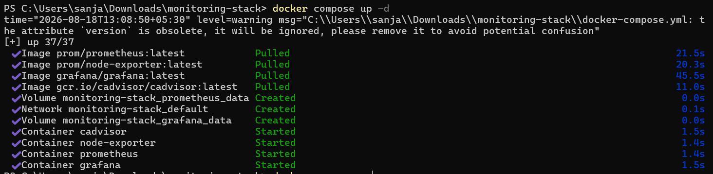
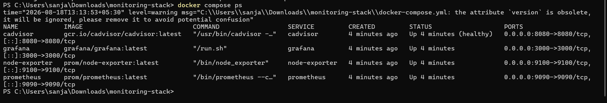
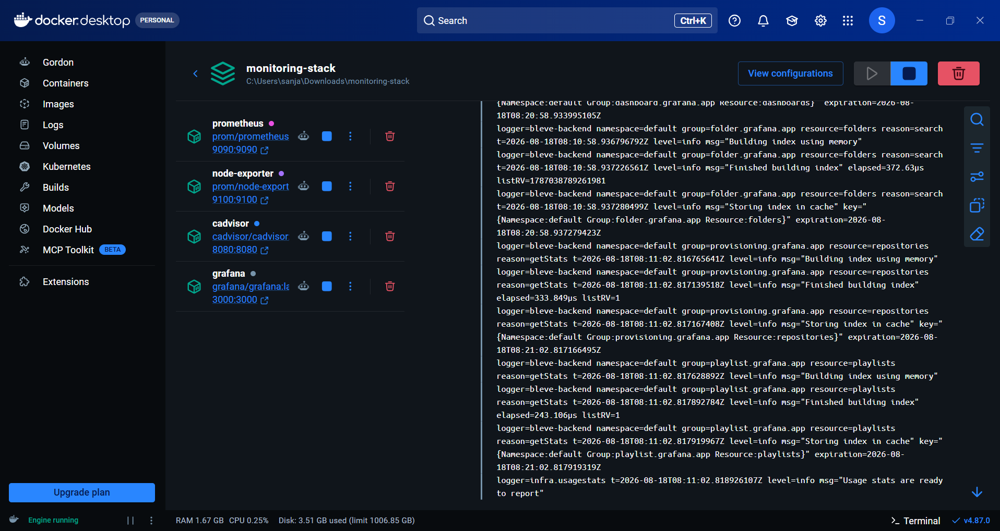
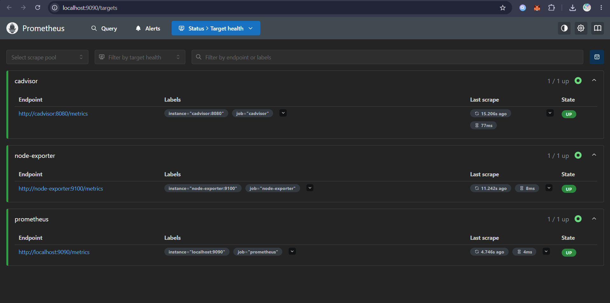
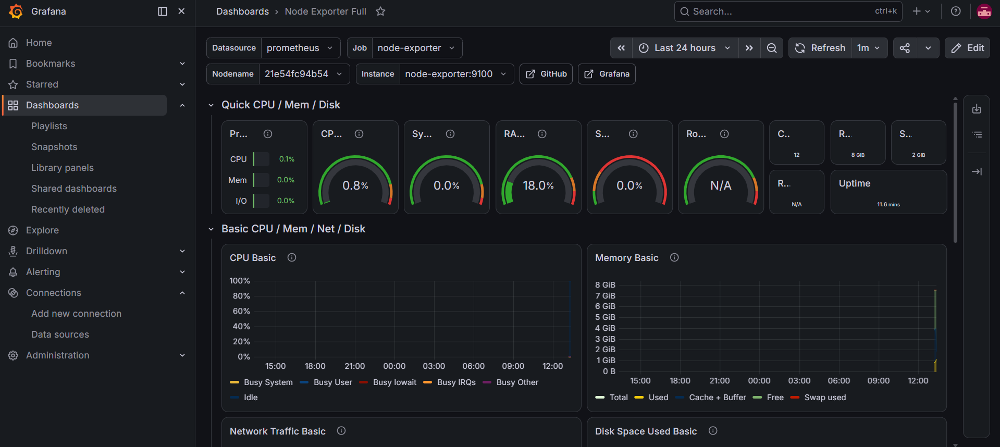
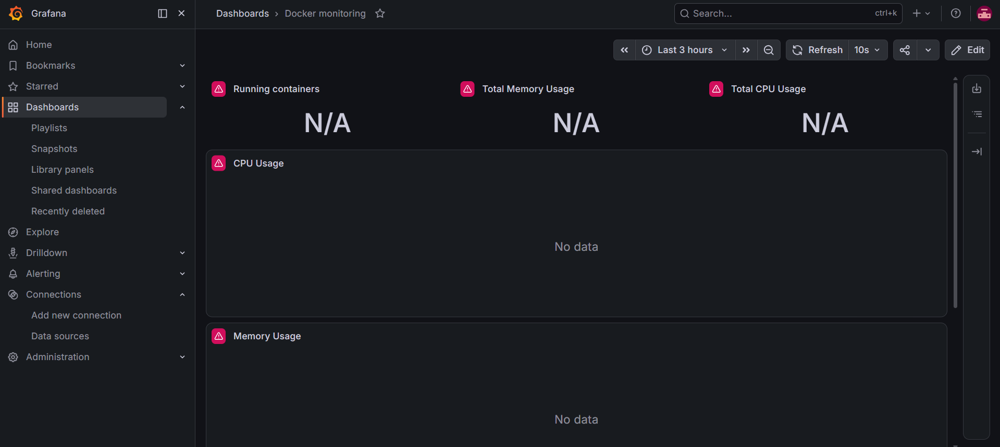

# Docker Monitoring Stack (Prometheus + Grafana + cAdvisor + node-exporter)

A hands-on learning project setting up the industry-standard observability
stack — Prometheus, Grafana, cAdvisor, and node-exporter — orchestrated with
Docker Compose, to understand how metrics collection, storage, and
visualization fit together in a real monitoring pipeline.

## What this is

Four containers working together:

| Service | Role |
|---|---|
| **Prometheus** | Time-series database. Scrapes metrics from targets on a schedule and stores them. |
| **Grafana** | Visualization layer. Queries Prometheus and renders dashboards. |
| **node-exporter** | Exposes host-level metrics (CPU, memory, disk, network) from the machine. |
| **cAdvisor** | Exposes per-container metrics — what each individual Docker container is consuming. |

Data flow: containers emit metrics → Prometheus scrapes and stores them →
Grafana queries Prometheus and displays it live.

## Why this stack

Prometheus + Grafana is the same combination real DevOps/SRE teams run in
production (or close variants like Prometheus + Thanos). This project uses
the actual production tooling, correctly configured, rather than a toy
simulation of monitoring.

## Setup

**Prerequisites:** Docker Desktop (with WSL2 backend on Windows)

```bash
git clone https://github.com/sanjanapulla06/docker-monitoring-stack.git
cd docker-monitoring-stack
docker compose up -d
```

Check everything's running:

```bash
docker compose ps
```

## Access

| Service | URL | Notes |
|---|---|---|
| Grafana | http://localhost:3000 | login: `admin` / `admin` (change on first login) |
| Prometheus | http://localhost:9090 | raw metrics + target health |
| cAdvisor | http://localhost:8080 | raw container metrics |

## Configuring Grafana

1. **Add data source:** Connections → Data sources → Add data source →
   Prometheus → URL `http://prometheus:9090` → Save & test
2. **Import a dashboard:** Dashboards → New → Import → ID `1860`
   (Node Exporter Full) for host metrics
3. **Custom container panels:** built manually with PromQL rather than
   relying on a pre-built community dashboard (see below)

## PromQL queries used

Per-container CPU usage (%):
```
rate(container_cpu_usage_seconds_total{name!=""}[1m]) * 100
```

Per-container memory usage:
```
container_memory_usage_bytes{name!=""}
```

## Screenshots

**Stack coming up via Docker Compose:**


**All 4 containers healthy:**



**Prometheus confirming all scrape targets are UP:**


**Node Exporter Full dashboard — live host metrics:**


**Debugging the imported Docker dashboard (before fix — "No data"):**


## A debugging note (the actual learning part)

Importing a pre-built community dashboard (ID `193`) initially showed
"No data" on every panel, despite all Prometheus targets showing **UP** on
`/targets`. Diagnosis process:

1. Confirmed containers were healthy via `docker compose ps`
2. Confirmed Prometheus was actually scraping cAdvisor via the
   `/targets` page (all green)
3. Queried `container_cpu_usage_seconds_total` directly in Prometheus and
   confirmed real data existed
4. Concluded the dashboard's pre-built queries used label filters that
   didn't match this cAdvisor version's output — not a scrape or
   connectivity issue
5. Rewrote the panel queries manually to fix it

This is standard monitoring triage: isolate whether the problem is the
data source, the scrape target, or the query — before assuming anything's
broken end-to-end.

## Known limitations (this is a learning project, not production)

- Single node, running on a personal laptop — no real workload being monitored
- Default Grafana credentials, no TLS
- No alerting rules configured (AlertManager not wired up)
- Currently monitoring the monitoring stack itself rather than a real application

## Possible next steps

- Point Prometheus/Grafana at a real workload (e.g. a Wazuh SOC lab VM) instead of self-monitoring
- Configure AlertManager with actual alert conditions
- Add authentication/TLS for a more production-realistic setup

## Tools

Docker, Docker Compose, Prometheus, Grafana, cAdvisor, node-exporter